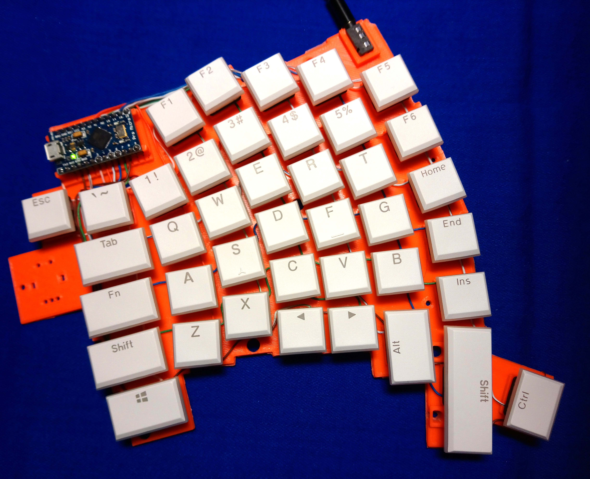
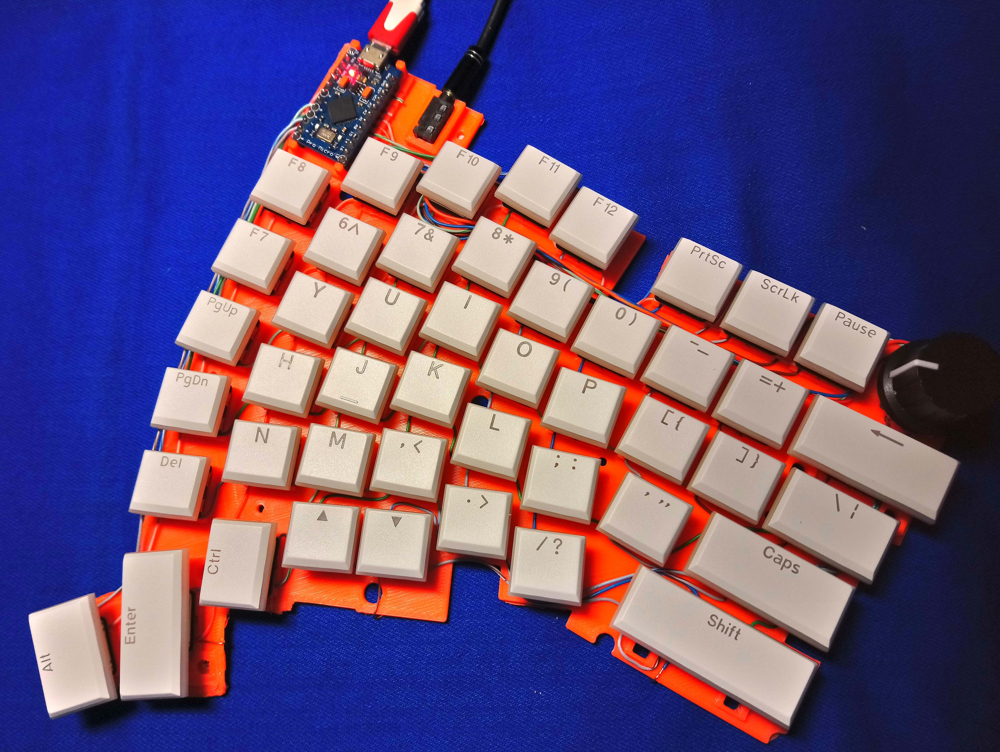
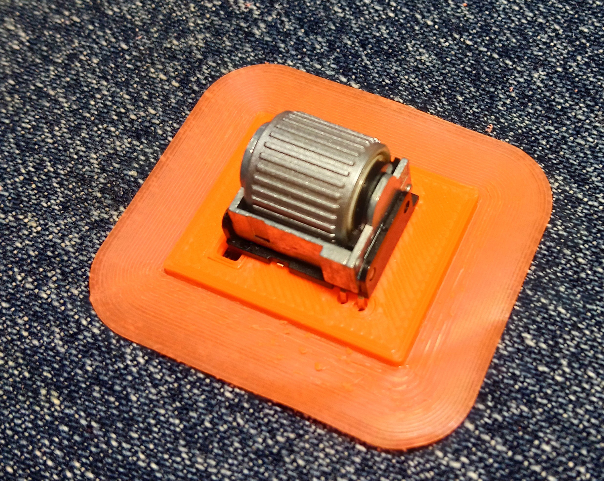
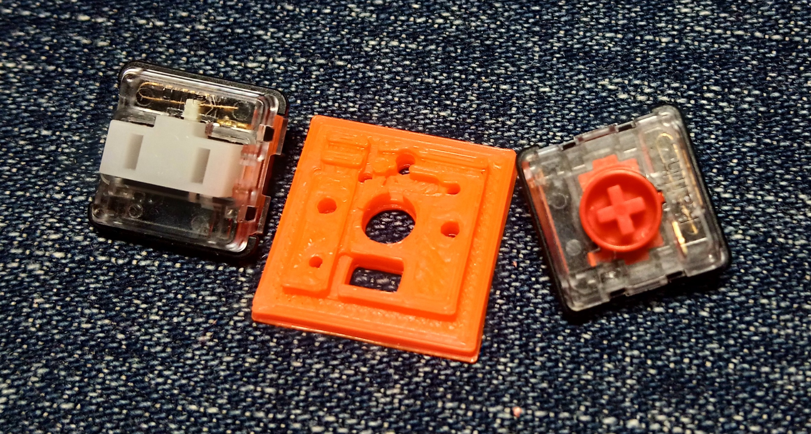
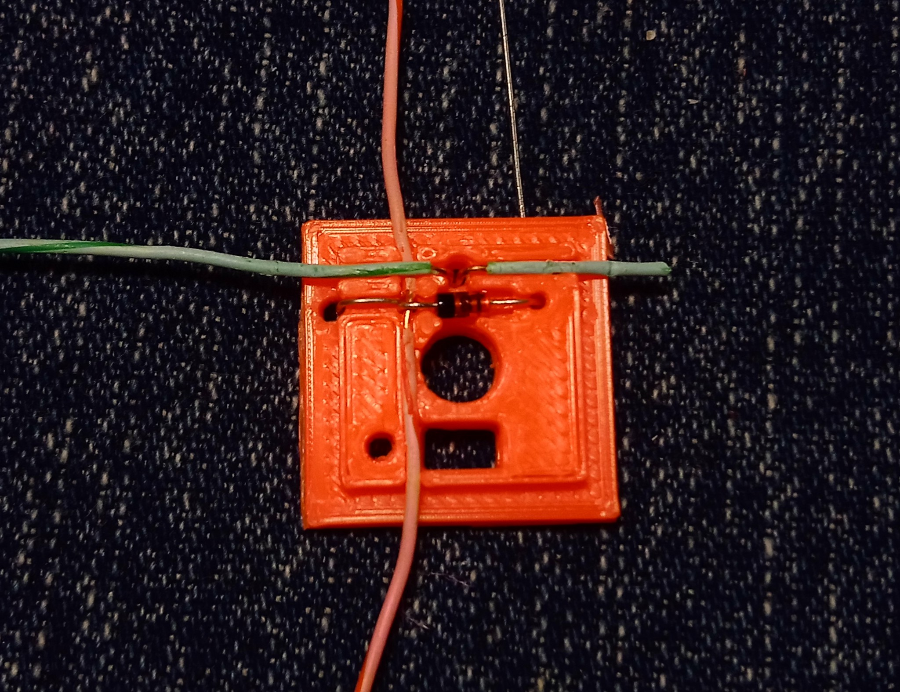
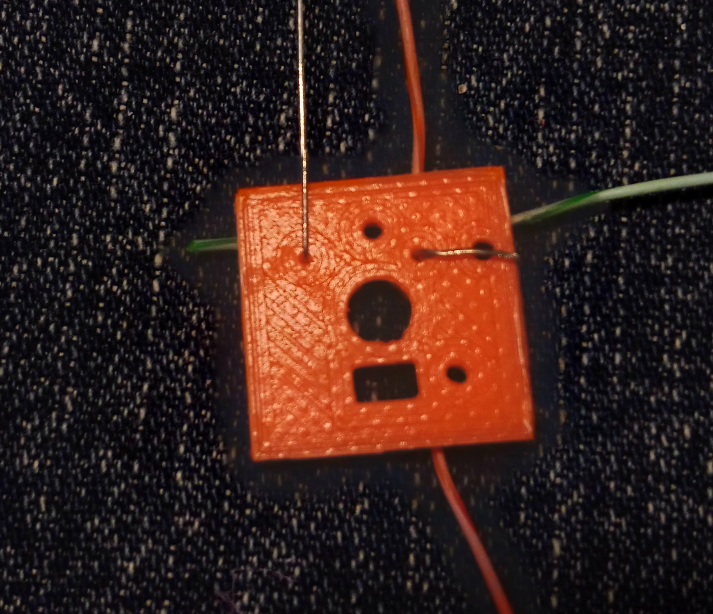

# 3D列印鍵盤熱插拔板產生器（網路線內芯線版本）

[原作者GitHub: 3D-Printable Hotswap Keyboard PCB Generator](https://github.com/50an6xy06r6n/hotswap_pcb_generator)

此專案為利用3D印表機，列印鍵盤底板、定位板、外殼..等部份來建構鍵盤，由於原作者使用22AWG電源線當主要線路，而我手邊有許多的廢棄網路線，所以就改用網路線內芯進行調整。

依照網路線內芯線的特性，修改了不少 switch.scad 的部份，主要是線材細，可以放入二極體，另外也添加了不少種類的軸體，以及MCU等額外鍵盤用零件。

### 額外特性
- 支援多種軸體：Cherry MX-style、MX Low profile、Kailh Choc V1、Choc V2、Choc Mini，Gateron KS27、Romer G、Redragon low profile。
- 單PCB可以放上多種不同軸體，layout.scad可以進行調整。
- 支援多種MCU：ProMicro、ProMicro C、Elite C、Pico RP2040、RP2040 Zero。
- 支援編碼器：EC11、EVQWGD001。
- Choc V2 矮軸可以使用MX規格的衛星軸（穩定器)。
- 支援4pin微動開關(microswitch)。

### 限制
因目前著重在Kailh Choc矮軸的使用開發，因矮軸上PCB板後高度較低，較不易被撥動掉落，所以定位板、底板、外殼、墊高都沒有跟著調整，主要是PCB主板印出來，直接裝上軸體使用，所以除了pcb.scad外，其他部份使用上可能會有點問題。

### 資料夾/檔案命名
由於對GitHub作業還不是很熟悉，且自己的改動太多，所以不好直接更動原作者的檔案，因此目前先把自己處理的檔案與資料夾，後綴都加上UTP，相關程式也有調整。

### 設計
可以優先參考原作者[設計指南(Design Guide)](https://github.com/50an6xy06r6n/hotswap_pcb_generator/blob/main/guide/design_guide.md)

修改版本的前期設計請參考（撰寫中）。

### 組裝
請參閱以下Blog:

[嘗試Choc V2矮軸與拉線教學](https://ie321mx.blogspot.com/2021/09/choc-v2.html)

[關於二極體版本的補充教學](https://ie321mx.blogspot.com/2021/09/blog-post.html)

原作者的[組裝指南(Build Guide)](https://github.com/50an6xy06r6n/hotswap_pcb_generator/blob/main/guide/build_guide.md)

### 照片集

UC2 鍵盤 Choc V1 軸體 左手

UC2 鍵盤 Choc V1 軸體 右手

EVQWGD001 編碼器

Choc V1 + V2 軸共用座

二極體接線後的狀態

二極體接線後的狀態 背面

